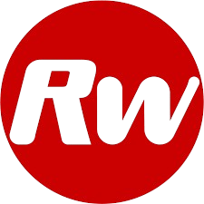

#   Red & White Website with React & Bootstrap

This project is a **fully responsive website** developed using **React** and **Bootstrap**, designed with a clean and attractive UI. It includes **smooth animations**, an **animated carousel**, and **card sections built with reusable props**, ensuring scalability and maintainability. The focus is on delivering a seamless user experience with a modern, responsive layout that works flawlessly across all devices.

---

## 🚀 Features
- Fully Responsive Design  
- Smooth Animations  
- Animated Carousel  
- Card Sections using Props  
- Attractive & Modern UI  

---

## 🛠️ Tech Stack

    
  <b>React</b> - Component based frontend library for building UI  
    
    
  <b>Bootstrap</b> - CSS framework for responsive layouts  
    
    
  <b>CSS3</b> - Styling with animations and effects  

  

---

## 📸 Project Preview

---

